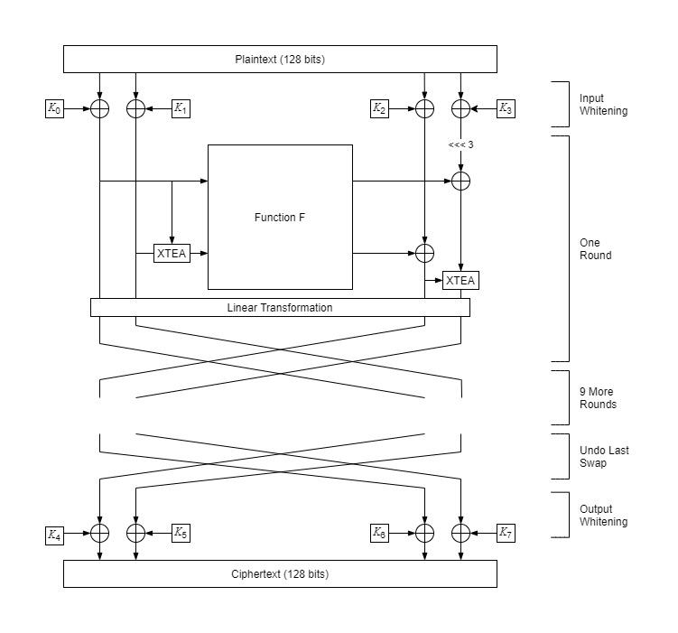
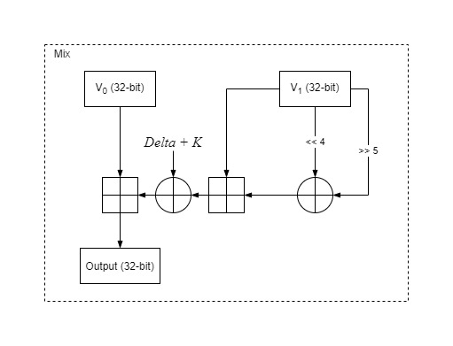
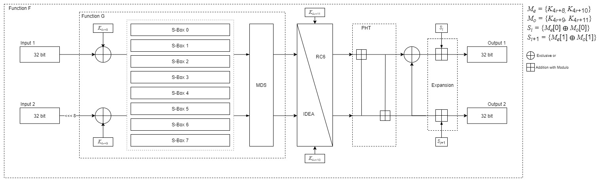
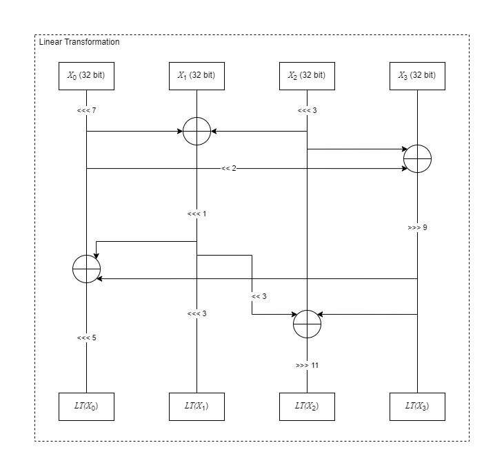
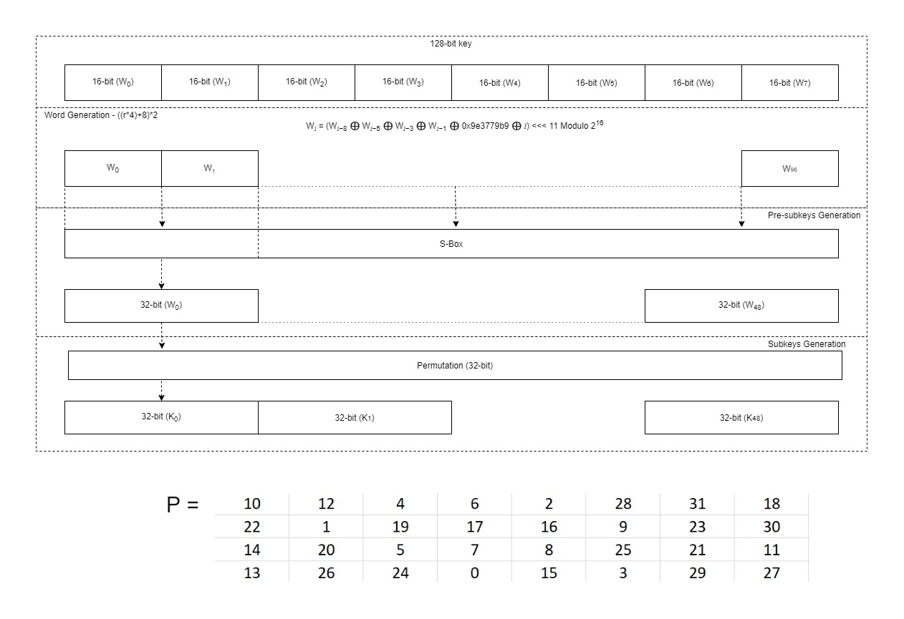

# Chimera-Encryption
Chimera is the combination of features from the 5 different algorithms. By definition, an organism that contains 1 or more DNA is known as a Chimera. Hence, this was how its name was originated. Chimera uses a structure similar to TwoFish as well as implementations from Serpent, XTEA, IDEA and RC6.

## Features/Characteristics 

Chimera is a symmetric block cipher that uses the same key for encryption and decryption. Chimera has a block size of 128-bit and requires a fixed key-length of 128-bit. It is a 10-round block cipher that uses a Feistel network structure like TwoFish. The F Function in Chimera incorporated operations and features used in Twofish, Serpent, IDEA and RC6. Some operations include TwoFish MDS and PHT. In addition, Chimera uses Serpent’s S-boxes together with key mixing, Substitution and Linear Transformation. RC6 and IDEA algorithm are used in the Function F in alternate. XTEA provides more confusion and diffusion as it is used before and after Function F. Due to the complexity of this algorithm, it is stronger than most algorithm. 

## Detail Operations 

Chimera uses a Feistel network structure. Similar to TwoFish, in each round, half of the text block is sent through an F function, and then XORed with the other half of the text block. Chimera has "prewhitening" and "postwhitening” where the eight subkeys K0-K7 are XORed with the text block both before the first round and after the last round. These operations are called input and output whitening. Each round requires 4 subkeys from the key schedule. Keys are chosen based on a formula (K4r+8+i, Where r = {0, 1,..., 9} & i = {0,1,2,3}). The 128-bit plaintext would be divided equally into four 32-bit parts (A, B, C, D) where it will be XORed with the first four subkeys. For each round, B will go through 1 round of the modified XTEA algorithm with a roundkey[0] using A as V1 and B as V0. Two 32-bit words will serve as the input into the F function. After the two output of Function F is computed, D will rotate left 3-bit and XOR with the first output of F while C will XOR with the second output of F. Before going through the Linear Transformation, D will go through 1 round of the modified XTEA using C as the second input and roundkey[3] as the key. After Linear Transformation is completed, the 4 blocks will swap sides before going through the next round (A, B, C, D = C, D, A, B). At the last round, the swap will be undone and postwhitening occurs. This will result as the output of Chimera.  



### Modified XTEA 

This algorithm is a slightly modified and simpler version of XTEA. It takes in two 32-bit input, V0 and V1 and a 32-bit key. Like XTEA, V1 will add with modulo 232 the result of V1 shift left by 4 XOR V1 shift right by 5. Followed by XOR with the constant Delta + key. The result will be addition with modulo with V0. Since key scheduling was not needed, the only modification was the exclusion of chosen the subkey based on the formula from the original algorithm.  



### F Function 

The F function takes in 2 32-bit inputs (R0 and R1). The two input first goes through Function G, followed by either IDEA encryption or RC6 encryption. The encryption choice will be determined by the round index and roundkey[2] and roundkey[3]. Roundkey[2] and roundkey[3] will split to 2 parts resulting in 4 16-bit blocks which will be used as the keys for the chosen algorithm. Even rounds use IDEA while odd rounds go through RC6. The result will enter PHT to output a prime (a’) and b prime (b’). Next, the first output will be a’ XOR b’ together with addition with modulo with Si. The second output will be b’ using addition with modulo with Si+1.  
Si and Si+1 is derived from splitting the 4 round keys (k0-k3) into even and odd (Me, Mo). Si will be the result of Me[0] XOR with Mo[0]. Si+1 will be the result of Me[1] XOR with Mo[1]. This will result in the two outputs of Function F.  



### Function G

Function G is encapsulated within Function F where two 32-bit input is needed (G0, G1). G0 and G1 first XORs with roundkey[1] and roundkey[2] respectively. The next operation would be to cause more confusion using the S-Boxes. Similar to Serpent, each round uses only 1 S-Box and is chosen based on the round index modulo 8. The S-Box is a 4-bit to 4-bit substitution where the 32-bit block will be split into 4 Bytes and go through the chosen S-Box. Next, the 4 Bytes go through multiplication with the MDS matrix and forms back a 32-bit block. The same process would occur for G1, preferably in parallel to reduce computation time. The outputs of MDS will be the final result of Function G.  

### Linear Transformation

In this process, similar to Serpent’s Linear transformation, the two 64-bit blocks will each split to two 32-bit blocks resulting in four sets of 32-bit blocks (A, B, C, D). Block A will rotate left 7 times to A1 and C will rotate left 3 times to C1. A1 and C1 will XOR with B to output B1. Next, A1 will shift left 2 times to become A2.  Both C1 and A2 will XOR with D to output D1. B1 will rotate left 1 time and D1 will rotate right 9 times. Next, D1 and B1 will XOR with A1, followed by rotating left 5 times to produce A4. B1 will shift left 3 times to produce B2. Next, B1 will shift left 3 times and XOR with D1 and C1 which rotate 11 times to the right to produce C2. The final form will be four 32-bits block. Following that, A4 and B2 will combine to form Block-1 while C2 and D1 will combine to form Block-2.  



### Key Schedule 

Chimera follows a similar key scheduling process with Serpent as the key schedule used in Serpent is complex, flexible and compatible with Chimera. The subkeys should be generated during initialization to avoid accumulating run time when encrypting or decrypting. First, the 128-bit user supplied key will be split into 8 words (w) of 16-bits. The number of words needed are calculated by ((r*4) +8) *2 (E.g. 10 round needs 96 words). The same process of generating w is the same as Serpent which is XOR and shift 11 times using this formula wi = (wi−8 ⊕ wi−5 ⊕ wi−3 ⊕ wi−1 ⊕ φ ⊕ i) <<< 11. However, modulo 216 is used after computing this equation. Moving on, to generate the pre-subkeys, the words would go through Substitution using the S-boxes chosen based on (3-r) modulo 8. A pre-subkey is made up of 2 16-bit words, hence 2 words would go through the same S-Box. For example, pre-subkey [0] = S[3] (w[0], w[1]) and pre-subkey[1] = S[2](w[2], w[3]). An array of 48 32-bit pre-subkeys will be formed. To compute the subkeys, it is simply running each pre-subkey through a 32-bit Permutation box.  



### Decryption

Decryption for Chimera similar to encryption. Since a Feistel Cipher structure was used, decryption is mostly the process of encryption. First, the last swap will be undone. Next, the 4 blocks (A, B, C, D) will go through the Inverse Linear Transformation. Following that, block C and D will go through Function F to result in 2 output. The second output of F will XOR with Block C. Block D will go through Inverse XTEA before XOR with the first output of F followed by rotating right by 3-bit. Both sides of the blocks will then be swapped. This process repeats 9 more times to retrieve the plaintext. 


## Purpose

Chimera is a highly secure algorithm consisting of multiple operations throughout the encryption process. These operations provide strong confusion and diffusion. Trying to break this algorithm is same as trying to break 5 algorithms together. Chimera can be used in applications where high security is needed such as storage of passwords and sending of short message from on end to another. It can also be used together with Asymmetric algorithms for distribution of the symmetric key to provide more security. 

## Strengths 

Chimera increases confusion and diffusion due to the varying operations and number of algorithms used. The flexible design that Chimera has allows it to be implemented on a variety of applications, and it can be suitable for stream cipher, hash function and MAC. Use of S-boxes provides confusion and rotation of bits provides diffusion. Chimera has a round function that mixes up the operations from different algebraic groups, this makes it hard to attack mathematically. It is also strong against cryptanalytic attacks because of the XOR of subkeys into the input of the first and last rounds of the F functions. Moreover, the use of IDEA and RC6 makes the encryption stronger as IDEA is difficult to be broken through cryptanalysis attacks and RC6 is not vulnerable to known attacks to date. 

## Weaknesses 

Chimera only accepts a fixed key length of 128-bit. Chimera is based on various mathematical functions and hence it might be broken faster than brute force, such as cryptanalytic attacks. The use of fixed S-boxes is not as strong as that of key dependent S-boxes as the use of brute force might be able to break it. Moreover, using linear cryptanalysis, certain rounds of Chimera can be broken as it is possible to find one-bit to one-bit relations of the S-boxes. Chimera is a symmetric encryption, thus there is a need for a secure channel to be able to distribute the keys. As the number of users increases, Key management would be more complicated. The run time of Chimera is not as fast as compared to other algorithms due the number of operations and calculations used. 

# Usage

App.py uses chimera module to encrypt and decrypt files.

**Modes of Operation Available**
- Electronic Code Book (ECB)
- Cipher Block Chaining (CBC)
- Counter Mode (CTR)


**Flags**
- --encrpyt [-e]
- --decrpyt [-d]
- --gen_key [-K]
- --ECB [-1]
- --CBC [-2]
- --CTR [-3]

**Example**
```python
py App.py <file> --encrypt --ECB
```
